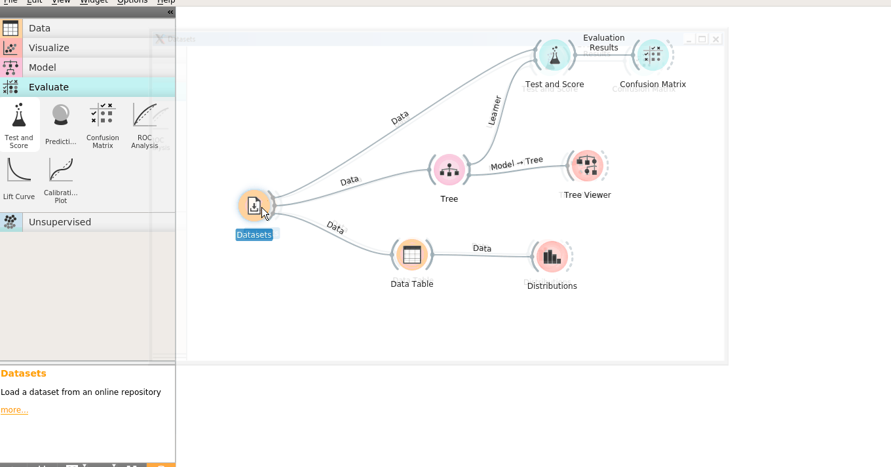
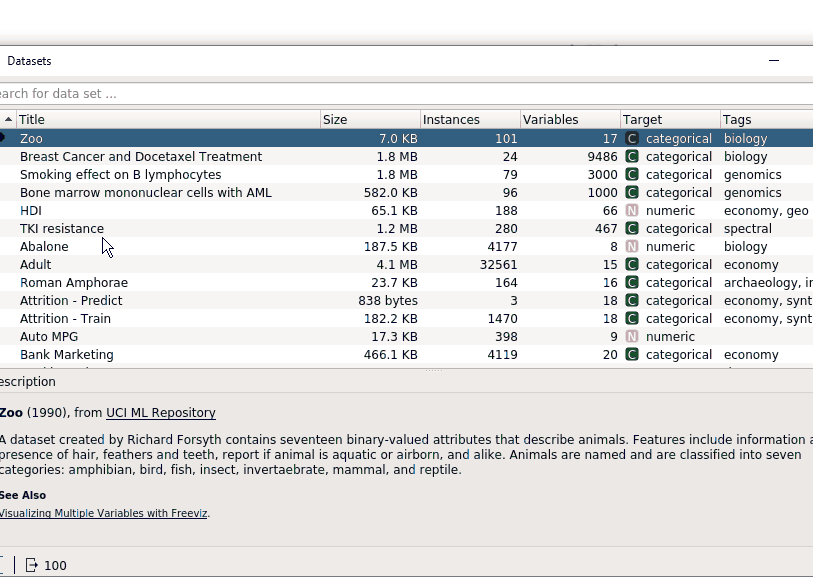

# Machine Learning Módulo

# Machine Learning

# Content

## [1. Classificação](./1-Classificacao/)
---
  ### Naive Bayes

  - Naive Bayes Classifier
 
 ---
  ### Árvore de Decisão

  - Decision Tree Clssifier 

   

      

---
  ### Aprendizagem por Regras 
  
    - CN2 Rule Induction

---
### Aprendizagem baseado em Instâncias
  - KNN (K-Nearest Neighbors) 

---
### Aprendizagem com Máquinas de Vetores de Suporte
  - SVM (Suport Vector Machine) 

---
### Regressão Logística
- Logistic Regression

---
### Validação Cruzada
- Cross Validation

---
## [2. Regressão](./2-Regressao/)
  - Regressão Linear

## [3. Agrupamento](./3-Agrupamento/)
  - K-means

## [4. Associação](./4-Associacao/)
  - Apriori

## [5. Aprendizagem por Reforço](./5-Aprendizagem-por-Reforco/)
  - 
  -
  - 

## [6. Visualização & Exploração de Dados Natural](./6-Visualizacao-Exploracao-Dados/)
  - Gráficos com o Orange
  -
  -

## [7. Tópicos Complementares](./7-Topicos-Complementares/)
  - 
  -

