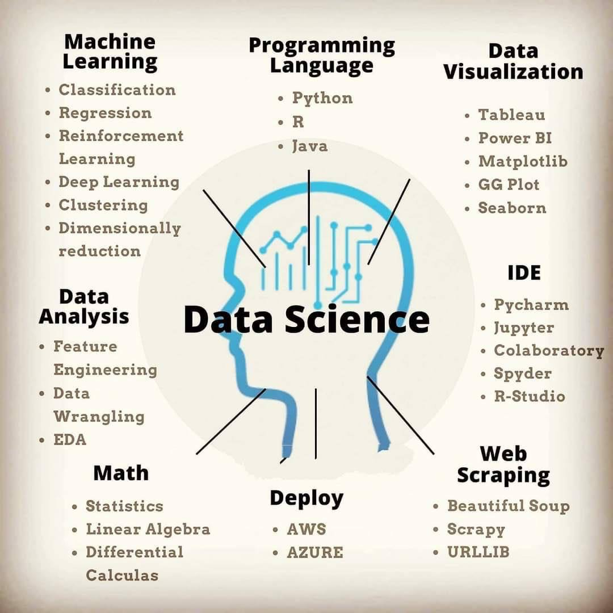

# My Data Science Journey

# Data Science 

# Data Science Joourney

# Data Science Joourney

# Data Science Components

# Content

## [1. Math & Statistics](./1-Math-Statistics/)
## [2. Python](./2-Python/)
## [3. Artificial Inteligence Guide](./3-3-Artificial-Inteligence-Guide/)
## [4. Data Visualization](./4-Data-Visualization/)
## [5. Data Analisys & Pipeline](./5-Data-Analisys-Pipepline/)

## [6. Big Data](./6-Big-Data/)

## [7. Machine Learning](./7-Machine-Learning/)

## [8. Deep Learning](./8-Deep-Learning/)

## [9. Reinforcement Learning](./9-Reinforcement-Learning/)

## [10. Analytics](./10-Analytics/)

## [11. R & RStudio](./11-R/)

## [12. Visual Computing](./12-Visual-Computing/)

## [13. APIs for AI](./13-API-AI/)

## [14. Data Science Apps](./14-Data-Science-Apps/)

## [15. Cloud & Deploys](./15-Cloud-Deploys/)

## [16. Data Science Guide](./16-Data-Science-Guide/)

## [18. Kaggle & AI Competitions](./18-Kaggle/)

## [19. GIS & Maps](./19-GIS-Maps/)

## [20. SQ](./20-SQL/)

## [21. Storing-Telling](./21-Storing-Telling/)

## [22. Web Scrapping](./22-Web-Scrapping/)

## [23. Autonomous Car](./23-Autonomous-Car/)

